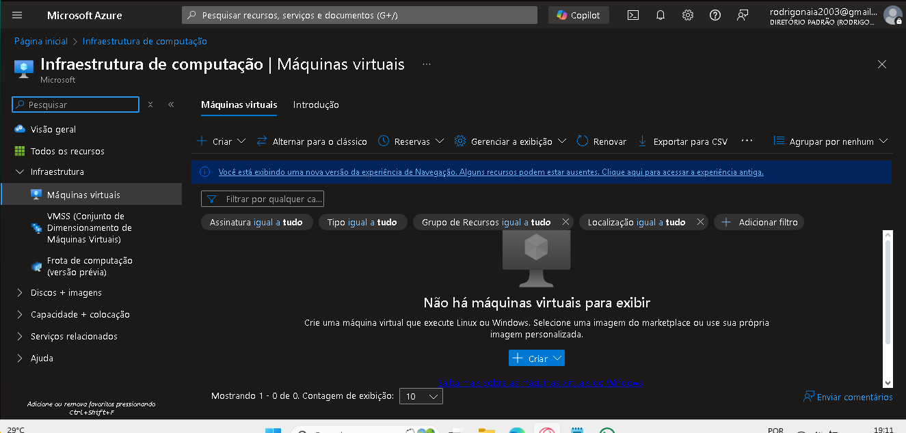

# Laboratório 2 - Microsoft Azure 50 Anos

O processo de criação de uma máquina virtual do Azure se dá por algumas etapas. Inicialmente, Acessando o ambiente na aba _Todos os Serviços_, conseguimos acessar o ambiente de recursos de computação e, consequentemente, visualizar o ambiente de criação de máquinas virtuais. São apresentadas algumas informações no ambiente, as quais estão atreladas somente ao escopo de máquinas virtuais. Nesse resumo, iremos nos ater somente ao procedimento de criação de uma _Virtual Machine_ (VM).

Para iniciar o procedimento, basta clicar no botão _Criar_ e selecionar a opção desejada. Nesse resumo consta a explicação referente a opção _**Máquina virtual do Azure**_. O ambiente redirecionará o usuário para uma nova tela. Nesse momento o processo de configuração da VM se inicia e a interface nos apresenta uma série de configurações básicas para o funcionamento da máquina. Ao todo, o procedimento de criação de uma máquina virtual segue a seguinte sequenciação de etapas: **Básico → Discos → Redes → Gerenciamente → Monitoramento → Avançado → Marcas → Revisar + Criar.** A seguir, temos um resumo do que é configurado em cada uma dessas etapas.

## 1. Básico
Aqui especificamos qual a assinatura será utilizada para o procedimento _"pay as you go"_ e a qual grupo de recursos a maquina estará associada. Em seguida devemos informar qual será o nome da nossa máquina, a região em que ela será executada, opções de disponibilidade (redundância de máquinas) e o tipo de segurança (confiabilidade da máquina). Além disso, devemos informar qual a imagem (sistema operacional) nossa máquina utilizará e qual o tipo de arquitetura do sistema, qual o tamanho que dará suporte a carga de trabalho (capacidade de processamento, memória e capacidade de armazenamento) e algumas outras configurações. Seguindo adiante, devemos informar qual será o tipo de autenticação do sistema da VM, o nome de usuário atrelado a máquina e a informação de parâmetros específicos (a depender do tipo de autenticação selecionado). Por fim, devemos informar qual será o tipo de entradas públicas e quais serão as portas de entrada. Por padrão, o acesso à máquina virtual é restrito a fontes na mesma rede virtual e tráfego das soluções de balanceamento de carga do Azure, mas o usuário possui a liberdade de estar configurando o acesso as portas. 

## 2. Discos
Aqui temos opções para gerenciar o armazenamento da máquina virtual. Logo de início, podemos definir se o disco da máquina possuirá criptografia no host. Esse procedimento fará com que a segurança do tráfego de dados seja mais robusta, logo é essencial para dados mais confidenciais. Em seguida, podemos definir o tamanho do disco do sistema operacional (SO), qual o tipo de disco, se ao excluir a máquina, instantaneamente, o disco será deletado e algumas configurações mais específicas de gerenciamento do disco no SO.

## 3. Rede
Nessa etapa definimos algumas configurações da interface de rede. Inicialmente, podemos definir uma rede virtual para a nossa VM. Essa rede possui, basicamente, o mesmo funcionamento de uma rede tradicional, na qual podemos configurar seus intervalos de endereços IP, sub-redes, tabelas de rotas, gateways e configurações de segurança. Além disso, podemos cadastrar um IP público para a máquina caso seja necessária uma comunicação com alguma máquina externa a rede virtual. Podemos configurar também qual será o grupo de segurança de rede do adaptador de rede, sendo esse responsável por permitir ou negar o tráfego de entrada ou saída para a máquina virtual. A depender da escolha, é necessário também a configuração de parâmetros específicos. Por fim, é possível escolher se iremos associar nossa máquina a uma solução de balanceamento de carga disponibilizada pela Azure, que será responsável por equilibrar o tráfego da Internet para a VM ou entre VM's presentes na rede virtual.

## 4. Gerenciamento
Nessa fase de configuração podemos definir se a máquina utilizará a licença gratuita ao plano do **_Windows Defender_** (antivírus), que será utilizada em todas as máquinas da rede virtual. Além disso, é possível configurar recursos relacionados a autenticação de usuários, como a habilitação da identidade gerenciada atribuída pelo sistema e a utilização do Microsoft Entra ID para realizar login na VM. Podemos programar um horário para que a máquina desligue automaticamente em um horário específico e a avaliação de atualizações no SO de maneira periódica, além de permitir escolher como será orquestração de patch para facilitar o gerenciamento de atualizações, aplicando patches em máquinas virtuais automaticamente e com segurança, limitando o raio de alcance das VMs.

## 5. Monitoramento
Nessa parte do procedimento podemos configurar a habilitação de regras de alerta, as quais servem para notificar sobre eventos importantes que ocorrem no recurso. Além disso, há também uma opção de diagnóstico personalizado, que é um recurso utilizado solucionar problemas de falha de inicialização de imagens personalizadas ou de plataforma e habilitar o diagnóstico de convidado do SO, recurso esse que gera métricas para a VM a cada minuto. Por fim, temos a opção de habilitar o monitoramento de integridade do aplicativo, o qual é necessário para a infraestrutura gerenciada da plataforma e para as atualizações do SO.

## 6. Avançado
Nessa etapa do procedimento podemos adicionar configuração, agentes, _scripts_ ou aplicativos adicionais por meio de extensões da máquina virtual ou _cloud-init_. Aqui são feitas configurações mais específicas e que estão mais diretamente relacionadas ao tipo de uso das máquinas virtuais, os acordos de nível de serviço (_SLA's_) que deverão ser atendidos e a necessidade do usuário. De modo geral, as configurações dessa parte estão ligadas ao funcionamento do sistema e das aplicações que a ele estão atreladas. 

## 7. Marcas
Marcas são pares de nome/valor que permitem classificar recursos e exibir faturamento consolidado aplicando a mesma marca a vários recursos e grupos de recursos. Ao configurar uma marca, podemos ter uma visualização personalizada da utilização de recursos da nossa máquina virtual.

## 8. Revisar + criar
Esse é o estágio final do procedimento de configuração de uma VM, no qual será feito uma varredura nas configurações realizadas nas etapas anteriores e nos apresentar uma visão geral a respeito. Além disso, aqui também é informado qual será o custo para operação do serviço e os termos legais para confirmação do processo de criação da máquina virtual.

### Informações Adicionais
O ambiente de configuração também pode nos fornecer ajuda para realizar o procedimento de configuração de máquinas, tanto nos explicando de maneira mais detalhada como funciona cada configuração de maneira específica, bem como no procedimento geral de configuração fornecendo uma espécie de _template_ de configuração, como podemos verificar na imagem abaixo.

